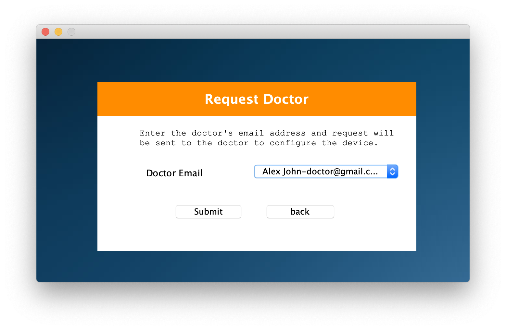
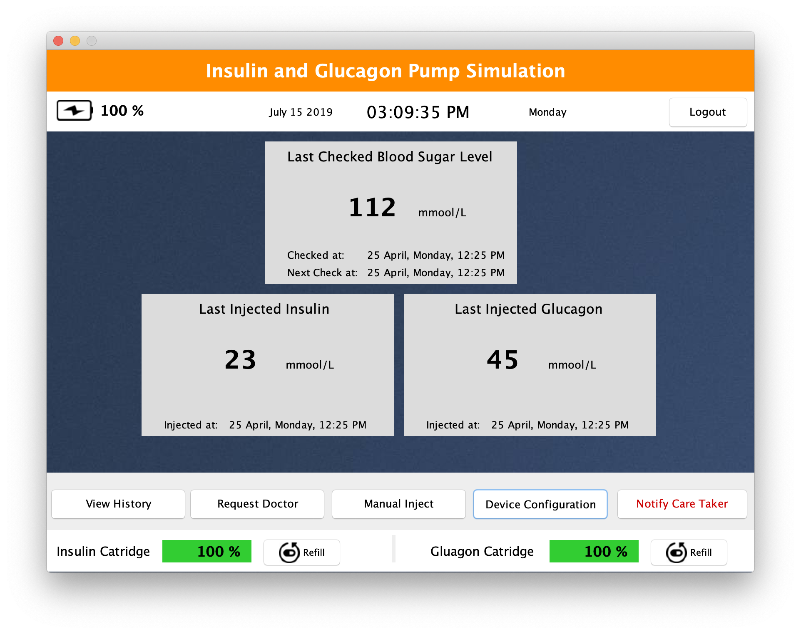

# Diabetes-Care

Insulin and Glucagon Pump Simulation

<!--ts-->
   * [Introduction](#introduction)
   * [ Installation ](#setup-guide)
   * [ Simulation](#simulation)
   * [ Live.](#live)
      * [ Patient Portal](#patient-portal)
      * [ Doctor Portal](#doctor-portal)
<!--te-->
   
<a name="introduction"></a>
## Introduction
This project has basically two parts.
- **Simulation** that just takes input some parameters and run the simulation of Blood Glucose Level over the time
- **Live** that contains the complete implementation i.e.  signup/signin of the doctor/patient/nurse/care taker and everybody has their own portal with restricted privliges

<a name="setup-guide"></a>
### How to setup this project on your machine

If you are using **Windows** then install the following Softwares:
- XAMPP can install by following [this](https://pureinfotech.com/install-xampp-windows-10/) guide. 
- Eclipse can be installed from [here](https://www.eclipse.org/downloads/)


And if you are using **MacOS** then install the following softwares:
- MAMP can be installed by following [this](https://wpshout.com/quick-guides/how-to-install-mamp-on-your-mac/) guide
- Eclipse can be installed from [here](https://www.eclipse.org/downloads/)


After the successfull installation of softwares, Run the eclipse

Then import the project into eclipse
Click on ```File``` -> ```Open Projects from File System``` -> ```select project folder where Start.Java is located```

Our sample exported database is located in ```database/d-care.sql```
So, import this database file into XAMPP/MAMP

You are just one step behind the installation. Now, you need to set the database configuration (database name/ username/password/) in ```model/Database.java```

All Set. Just run the Start.java file and you should be able to see the Main Screen. 

<a name="simulation"></a>
# Simulation

Simulation screen of the Insulin/Glucagon pump will ask the user to enter the parameters for the simulation. Following parameters needs to set for running the simulation:
- **Blood Glucose Level** at start of the simulation
- **Max Dose** a patient can take in a day ( It varies according to patients situation)
- **Sensitivity Model** that defines the Glucose Sensitivity. It depends on patient's health. Most used sensitivity model are 1500, 1700, 1800
- **Total Days** for the simulation. Then simulation Graph will be presented for that days
- **Simulation Delay** that shows the live graph accordingly. If the delay is shorter, then graph will be presented with speed. Or to see the graph changes slowly, simulation delay should be set to lower value. 
- Then **food routine** needs to be set for the patient. That which food he/she takes in the breakfast, lunch and dinner. And what are total number of carbohydrates in the food for each time. 


The resultant Graph will be as follow:


<a name="live"></a>
# Live

Following is the main screen where user can select the mode of the project (simulation or live) : 


After selecting the Live mode, user will be able to signup/signin: 


Signup screen will be look like as following:


Signin screen will be look like as following:

<a name="patient-portal"></a>
## Patient Portal

When patient will login into the portal for the very first time. Following screen will be shown to the patient in which he will be asked to request the doctor to configure the device. 


When patient click on "Request Doctor", then the following screen will be shown to the user. Where patient can select the doctor from the dropdown list. Then the request will be sent to the doctor to configure the device. 



Patient can view the configuration of device. And can also set his/her food routine so that the dose will be calculated accordingly. 


If the patient's device is configured successfully. Then the patient's screen will be as following:


<a name="doctor-portal"></a>
## Doctor Panel

Doctor's main screen contains two tables. 
- Upper table shows the list of all the requests that are made by patients to configure the device. 
- And the lower table shows the list of all patients consulted by current doctor. Then doctor can click the specific patient and view his/her history


When doctor click on specific patient to configure the device. Then  screen will be look like as following:


